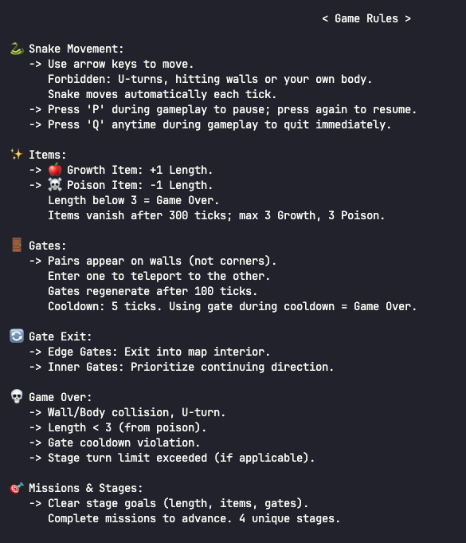

# Terminal Snake Game (C++ & ncurses)

> A stage-based terminal snake game implemented in C++ using the `ncurses` library.  
> Includes gates, missions, stage progression, scoring system, and more.



## 🎮 Game Features

- Arrow-key controlled snake with auto-movement
- Items:
    - 🍎 Growth Items: +1 Length
    - ☠️ Poison Items: -1 Length
- Gates:
    - Teleport between gate pairs
    - Cooldown system and gate regeneration
- Stage system:
    - 4 unique stages with missions (length, item collection, gate use)
- Game Over conditions:
    - Wall/Body collision
    - U-turn
    - Length < 3
    - Using gate during cooldown
    - Stage time limit exceeded
- Scoring and ranking system saved to `highscore.txt` and `ranking.txt`
- Gameplay demo available

## 📦 Files

- `snake_game.cpp` — Main game source code
- `Makefile` — Compile instructions
- `highscore.txt` — Local high score record
- `ranking.txt` — Cumulative ranking data
- `snake_game_rules.png` — Game rule image
- `snake_game_demo.mp4` — Gameplay demo video

## 🔧 Build Instructions

```sh
make
```

This will compile `snake_game.cpp` using the provided `Makefile`.

Ensure that you have `ncurses` installed:

```sh
sudo apt-get install libncurses5-dev libncursesw5-dev
```

## ▶️ Run the Game

```sh
./snake_game
```

## 🧠 Rules Summary

- **Movement**: Use arrow keys. U-turns and self-collisions cause Game Over.
- **Growth/Poison**: Snake must maintain length ≥ 3 to survive.
- **Gates**: Appear on walls. Entering during cooldown results in Game Over.
- **Items**: Disappear after 300 ticks. Max 3 Growth and 3 Poison on screen.
- **Mission**: Complete each stage's length, item, and gate goals.

## 📹 Demo

A sample gameplay is included in `snake_game_demo.mp4`.

## 🏆 High Scores

Scores are automatically saved after each game. Rankings are viewable in `ranking.txt`.

If `highscore.txt` or `ranking.txt` does not exist, they will be created automatically on the first run.

## 📜 License

This project is for educational and non-commercial use only.  
Feel free to fork and expand upon it!
